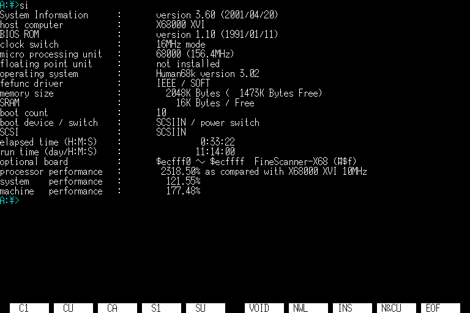
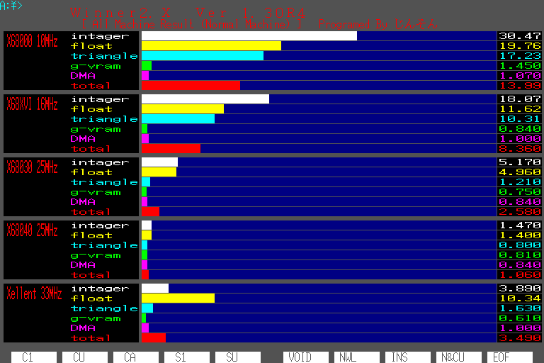
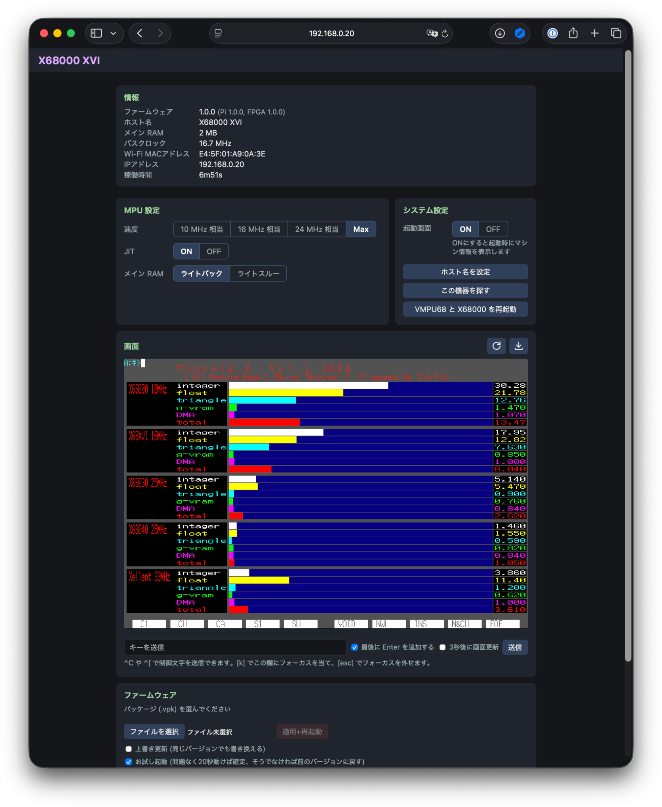
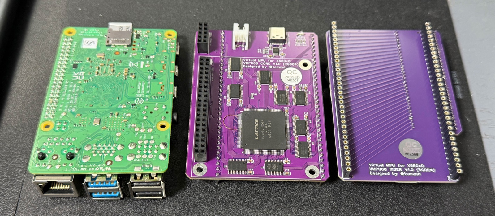
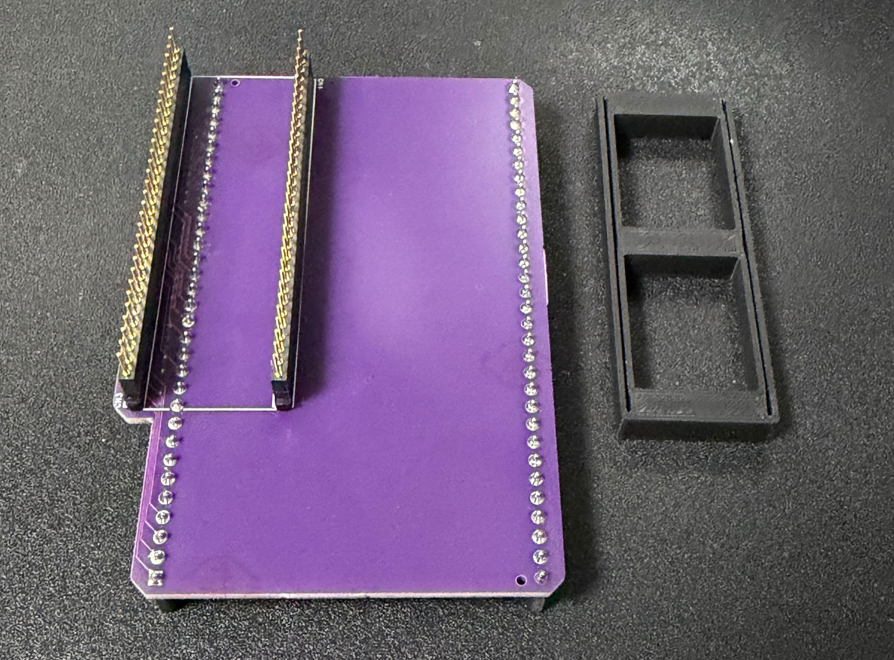
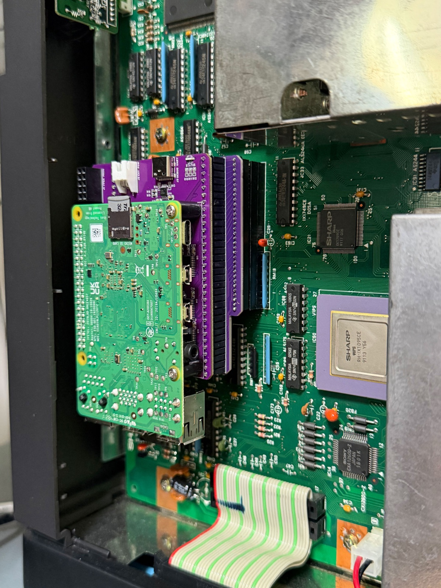

# VMPU68

Raspberry Pi を使用した X68000 シリーズ用 MPUアクセラレータ

## 概要

Raspberry Pi で動作する X68000 シリーズ用の MPUアクセラレータです。
独自開発したボードに Raspberry Pi 4 を装着し、X68000のMPUソケットに装着して使用します。  

### システム要件

* X68000 XVI
  * 現在は X68000 XVI のみで動作確認しています。
  * 理論上は X68000 SUPER 以前の機種でも物理的に接続できれば動作するはずです。
* Raspberry Pi 4
  * メモリ1GB以上。
  * 開発では4GBモデルを使用しています。計算上は1GBで十分と思います。
  * Raspberry Pi 3 や 5 では動作しません。
    * BOOTHで頒布している基板はモデルによって Raspberry Pi 3/4 とシルク印刷されていますが、Raspberry Pi 3では動作しません。

### 基板バージョン

* V1.0: 初版
* V2.0.1 （未頒布）: FPGAのピン配置を変更し、X68000とのバス接続が少し高速化したバージョン
* V2.1 （未頒布）: VMPU68 CORE 上に16MBのPSRAMを搭載し、メインメモリおよび拡張メモリとして使用できるバージョン

V2.0.1 以降のバージョンは今後頒布予定です。うまく動作しないなどの理由でキャンセルする可能性もあります。

### 機能

#### MPU機能

X68000 XVI の 16MHz + Raspberry Pi 4 使用時に si.r 測定で 2318% のパフォーマンスが出ています （JIT ON, ライトバック）

* 命令実行時にウェイトをかけ、10MHz相当, 16MHz相当, 24MHz相当で動作もできます
* MC68000命令をARMネイティブ命令に変換して実行するJITが使えます
* メインメモリをRaspberry Piのメモリにコピーして実行します
* さらにメインメモリへの書き込み時にすぐには書き込まず、必要な時まで保持して実行することもできます （ライトバック）
* Web UIを持ち、Web UIから速度/JIT/RAM動作を設定できます
* 起動時にX68030風の起動画面を表示できます

 
 

### Web UI 機能

Raspberry Pi をWi-Fi接続するとWeb UIが使えます。

* MPU設定（速度/JIT/メモリ書込設定）を常時変更できます
* 起動画面のON/OFFを設定できます
* X68000をリセットできます
* X68000で現在表示してる画面をWeb UIの中に表示・ダウンロードできます（静止画）
* X68000にキーを送信できます
* ファームウェアをアップデートできます
* RG002 VFD68, RG003 VHD68 が同一ネットワーク内にあれば一覧表示し、そのWeb UIを開けます
* macOS の Safari と Chrome で動作確認しています

 

## セットアップ

### ソフトウェアセットアップ

#### microSDへのイメージの書込

Raspberry Pi Imager を使用して、vmpu68-sd-x.y.z.img.xz (x.y.zはバージョン）をSDカードに書き込みます。  
vmpu68-sd-x.y.z.img.xz はこのリポジトリの Releases ページから最新版を取得してください。  
下記手順は macOS でのものです。Windows の場合、適宜読み替えしてください。  
  
1. Raspberry Pi Imagerを起動する
2. Select your Raspberry Pi devide で Raspberry Pi 4 を選択して [次へ]
3. OS で "カスタムイメージを使う" から vmpu68-sd-x.y.z.img.xz を選択して [次へ]
4. Select your storage device で書込先の microSD カードを選択して [次へ]
5. Write image で [WRITE]
6. 確認ダイアログが開くので [I UNDERSTAND, ERASE AND WRITE]
7. [FINISH] で完了
8. SDカードを一度取り外して再度接続し、設定ファイルを編集する （次項参照） 
9. Raspberry Pi にSDカードを挿入する

#### 設定ファイルの編集

SDカードの中にはファームウェアファイルと設定ファイルが含まれています。

##### vmpu68.cfg

vmpu68の動作設定を記述するファイルです。この段階では変更しなくてOKです。ほぼ全ての項目は Web UI や、VMPU68.X から設定でき、設定するとこのファイルの設定値が変更されます。  
書式は 1 行 1 項目の `key=value` です。`#` で始まる行と未知の行は無視されます。

| 項目          | 値                        | 説明                                                                                                                                                                                                                 |
|-------------|--------------------------|--------------------------------------------------------------------------------------------------------------------------------------------------------------------------------------------------------------------|
| `name=`     | 文字列(31 バイトまで)            | 表示名。Web UIのシステム設定欄の設定、VMPU68.Xの `-n` オプションと同じ。 Web UI のヘッダ, LAN 内の他機器(vhd68/vfd68)の機器一覧に表示されます。 既定値 `X68000`                                                                                               |
| `mhz=`      | `0` / `10` / `16` / `24` | MPU の速度上限。Web UI の**速度**、VMPU68.X の `-s` と同じ。 `0`: Max(上限なし) `10`/`16`/`24`: 命令実行にウェイトを挿入して MC68000 の各クロック相当の速度で動作します。 規定値: 0                                                                          |
| `wb=`       | `0` / `1`                | メイン RAM の扱い。Web UIの**メインRAM**、VMPU68.Xの `-w` と同じ。 `0` = ライトスルー … 書込を毎回実 RAM にも行います。ライトバックで動作に問題がある場合に使用します。  `1` = ライトバック … Raspberry Pi 側のシャドウ RAM で動作し、実 RAM へは必要時に書き戻します。ライトスルーより高速に動作します。 規定値: `1` |
| `jit=`      | `0` / `1`                | 68000 命令を AArch64 に実行時に変換して実行。MPUの速度上限が**Max**の時のみ有効。Web UIの**JIT**、VMPU68.Xの `-j` と同じ。 `0`: 無効 / `1`: 有効 規定値: `1`                                                                                         |
| `sramboot=` | `0` / `1`                | 起動画面。 有効化すると X68000 の SRAM に起動プログラムを書き込み、電源 ON/リセット時に X68030 風に MPU/RAM/CLOCK 表示します。 `0`: 無効 / `1`: 有効 規定値: `1`                                                                                        |
| `ram=`      | `1`〜`12`(MB)             | メイン RAM の容量。自動検出されるので通常は設定不要。                                                                                                                                                                                      |
| `hw=`       | `1.0` / `2.0.1` / `2.1`  | 基板の版数。自動判別されるので通常は設定不要。 Web UI の「基板」と「近くの機器」に表示されます。                                                                                                                                                           |
| `smi=`      | `0` / `1`                | Raspberry Pi と FPGA の間の転送に SoC の SMI(並列バス機能)を使う。V2.0 以降の基板でのみ有効。 `0`: 無効, `1`: 有効 規定値: `1`                                                                                                                  |
| `board=`    | (自動)                     | ファームウェアが基板の種類を記録するために記録。編集不要。                                                                                                                                                                                      |

##### wpa_supplicant.conf

Wi-Fi設定を記述するファイルです。 `wpa_supplicant.conf.example` を `wpa_supplicant.conf` にリネームして使用してください。

### ハードウェアセットアップ

VMPU68 は3つのコンポネントから構成されています。

**CORE:** Raspberry Pi の動作を補助し高速な動作を実現するコンポーネント。FPGAにファームウェアをインストールしてRISER と Raspberry Pi 4 を接続して使用します。

**RISER:**  COREをX68000に接続するための下駄。X68000 XVIに接続する時は右上にX68000用ピンが来る向き、それ以外のマンハッタンシェイプマシンに接続する時は左下にX68000用ピンが来る向きにCOREを接続して使用します。(*1)

**Raspberry Pi 4:** VMPU68 のメインコンポーネント。ファームウェアを書き込んだ microSD カードを挿入し、COREに装着して使用します。X68000 XVIでも、それ以外のマンハッタンシェイプマシンでも常に下にLANコネクタが来る向きで使用します。(*1)

*1) 現時点では X68000 XVI 以外の機種では動作確認できていません

#### 組み立て

VMPU68 RISER → VMPU68 CORE → Raspberry Pi 4 の順番に重ねて組み立てます。  
RISERの向きに注意してください。X68000 XVIに装着する時は写真の向き（右上が出っ張る形）です。  

 

VMPU68 CORE と Raspberry Pi 4 は2本のねじとスペーサーで固定します。（VMPU68 COREには穴が4つあいていますが、GPIヘッダから遠い2本（写真右側の2本）のみ固定します。）
  
動作未確認ですが、RISERのみ180度回転して左下が出っ張る形にするとX68000 SUPER以前のマンハッタンシェイプ機種にも取付できる可能性があります。ソフトウェア実装としてX68000 XVIに特化した実装はしていないはずなので物理的な取付ができればX68000 XVI以前の機種でも動作する可能性は高いと思います。  
（At your own riskですが、動作したよ情報、お待ちしています。）  
  
#### 取付

VMPU68 RISERにはピン保護のために保護材を取り付けていますので取り外してください。（写真右が保護材）  

 

これ以降はX68000の電源を切ってACプラグもはずした状態で作業してください。  
  
X68000 XVIへの取付にはメイン基板のシールド除去が必要です。  
シールド除去は [@HirofumiIwasaki](https://x.com/HirofumiIwasaki) さんの [X68000XVI 修理マニュアル レトロマシン修理マニュアル⑤](https://booth.pm/ja/items/1000694) が参考になります。  
  
シールドを除去したら、メイン基板に装着されているMC68000を取り外します。  
  
メイン基板のMC68000はICソケットに装着されていますので、専用の器具を使うか、マイナスドライバーでゆっくり慎重に取り外してください。

MC68000を取り外したらICソケットにVMPU68を装着します。BOOTHでの頒布では付属品として64ピンSDIPのICソケットを入れていますので、すでにメイン基板を改造しているなどでまわりのパーツとの接触が気になる方や、メイン基板のICソケットへのダメージが気になる方は、メイン基板のICソケットに付属のICソケットを取り付けその上にVMPU68を装着してください。 上や右からズレが無いようによく見てゆっくり確実に装着してください。  
  
写真はX68000 XVIにメイン基板→ICソケット→VMPU68 RISER→VMPU68 CORE→Raspberry Pi 4と接続した様子です。  
  

#### 起動

取付が完了したらACプラグやディスプレイを接続して X68000 の電源を入れます。  
初回起動では VMPU68 CORE に搭載された FPGA へのファームウェア書込が実行されます。Raspberry Pi 4 の赤LEDが点灯し、緑LEDが数回ゆっくり点滅した後、FPGA へのファームウェア書込が開始され、緑LEDが高速に点滅します。  
  
しばらくすると FPGA へのファームウェア書込が完了し、X68000 が起動します。  
Wi-Fi 設定がされていれば VMPU68 CORE 上のLEDが青に点滅し、接続完了すると青に点灯します。Wi-Fi 設定がされていない場合や、接続できなかった場合はLEDは緑に点灯します。

tools/lan-finder/lan-finder.html を開いて[スキャン開始]ボタンを押すと同一LAN内の VMPU68 を検索できます。  
検出されたら[開く]ボタンで VMPU68 の Web UI を開けます。

## 仕様

### LED仕様

VMPU68 CORE 上の LED と、Raspberry Pi 4 本体の LED(赤 = 電源、緑 = ACT) は以下の状況で点灯/点滅します。

#### VMPU68 CORE の LED

上の行ほど優先して表示されます。

| 表示 | 意味                                                                          |
|---|-----------------------------------------------------------------------------|
| 消灯 | FPGA が動いていない状態。FPGA にファームウェアが無い初回起動時と、FPGA ファームウェアの照合・書込み中。                 |
| 白の速い点滅 | Web UI で「この基板を探す」ボタンを押下した時。                                                 |
| 白の点灯 | 起動中、ファームウェアの初期化からエミュレータ開始までの間。                                              |
| 赤 | microSD カードアクセス中                                                            |
| 青の点滅 | Wi-Fi 接続中。60秒でタイムアウト。                                                       |
| 青の点灯 | 正常稼働中（Wi-Fi 接続済）。                                                           |
| 緑の点灯 | 青銅稼働中（Wi-Fi 接続なし）。 wpa_supplicant.conf ファイルが無いか、60 秒たっても Wi-Fi 接続できない時。 |

#### Raspberry Pi 4 本体の LED

| 表示       | 意味                                                                                          |
|----------|---------------------------------------------------------------------------------------------|
| 赤の点灯     | 電源が入っている                                                                                    |
| 緑の点滅     | ファームウェア動作中                                                                                  |
| 緑の速い点滅   | FPGA のファームウェアを照合・書込み中。 初回起動時の自動書込み、Web UI からのファームウェア更新など。この間 CORE の LED は消灯。完了すると再起動します |
| 緑の不規則な点滅 | microSD カードへのアクセス                                                                           |

